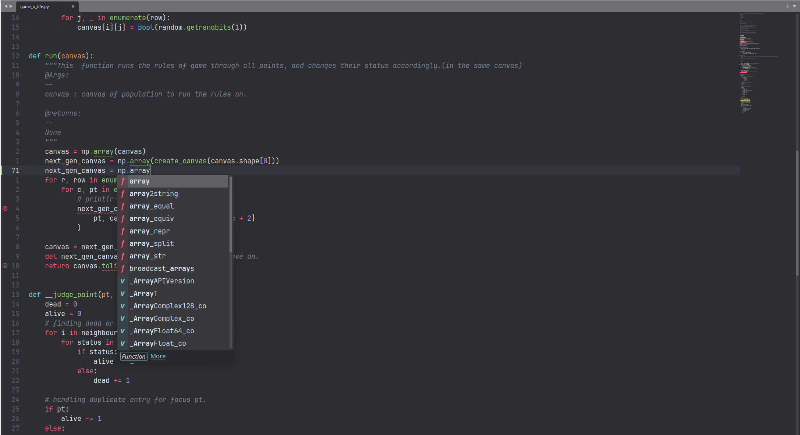
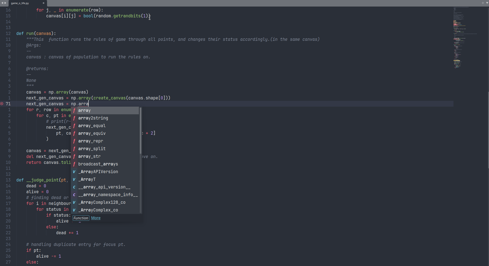
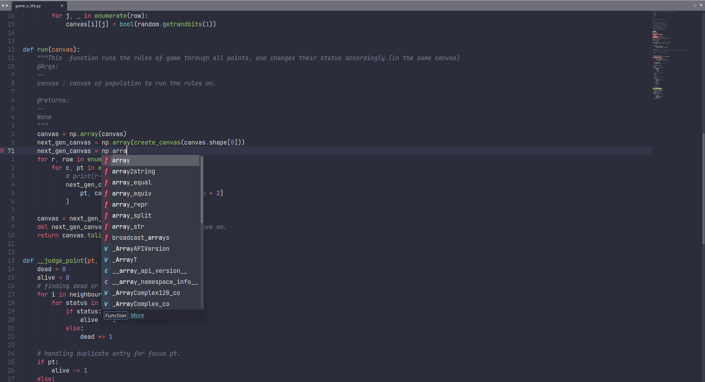
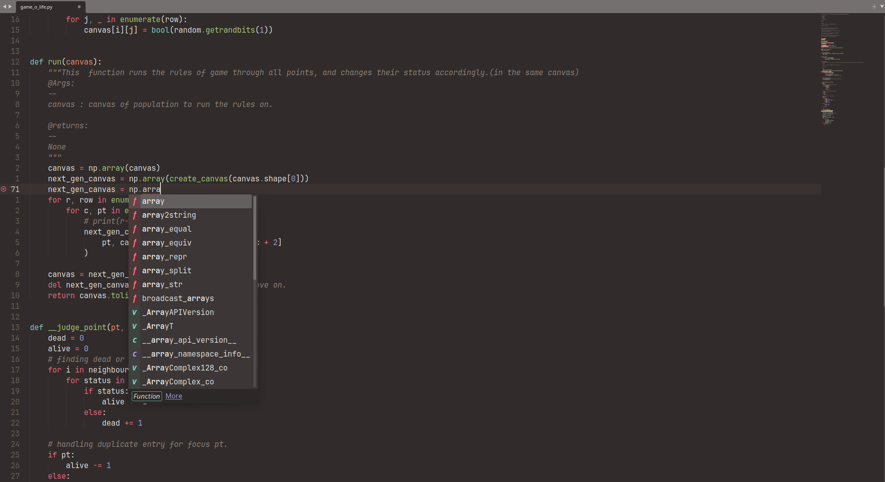
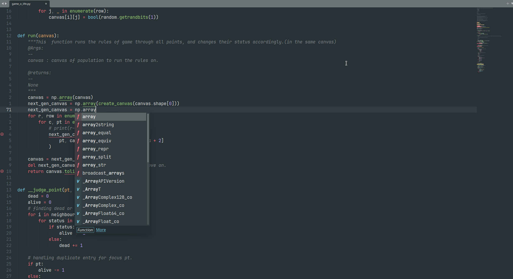
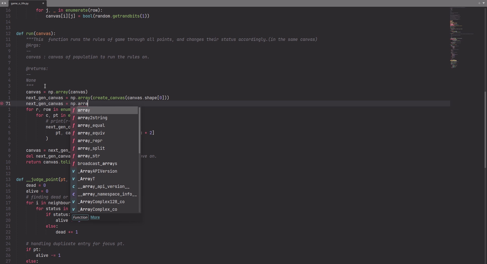

# Introduction

This is a port from [Sonokai Vim](https://github.com/sainnhe/sonokai) to be used in Sublime Text 4

## Colorscheme and Variant

### Default

### Atlantis

### Andromeda

### Espresso

### Maia

### Shusia

## License
MIT © Duy Huy Hoang DO
